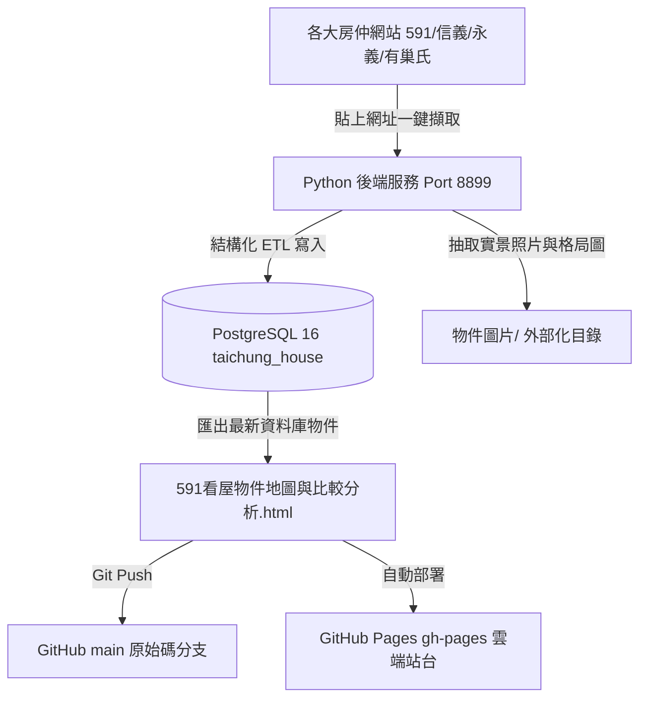

# 🏠 台中精選看屋決策分析平台 (Taichung House Hunting Dashboard)

專為 **張協聖 & 張安莉** 打造的台中中古屋買房全方位決策平台。整合了 **PostgreSQL 16 本機關聯式資料庫**、**自動化網頁房訊爬蟲 (Web Crawler)**、**921 歷史受損建物查核避雷名單**、**實地看屋與出價裝修筆記**，以及支援多維度篩選排序與實時決策分類的互動式前端儀表板。

🌐 **GitHub Pages 線上展示站點：** [https://derekhcw168.github.io/taichung-house-hunting/](https://derekhcw168.github.io/taichung-house-hunting/)

---

## 🌟 核心特色與架構



1. **PostgreSQL 16 關聯式資料庫架構**：
   - 擺脫過去以本機檔案資料夾搬移的舊方式，全面實現資料庫化。
   - 涵蓋 68+ 筆物件、2,100+ 張現場照片索引、18 筆現場看屋筆記、76 筆 921 震災查核名冊與 15 項買方偏好檢核標準。
2. **網址貼上一鍵自動抓取入庫 (Web Auto-Crawler)**：
   - 在儀表板頂部貼上 591、信義、永義、有巢氏等各大房仲網址，即可自動連線解析並寫入 PostgreSQL，同步下載照片至專屬子目錄。
3. **動態決策分類與刪除**：
   - 支援「📌 待看物件」、「❤️ 看完列入考慮」、「✕ 看完不考慮」三態即時切換。
   - 支援物件刪除功能，連帶安全清理關聯來源與圖片索引。
4. **雙向版本控管與雲端發布**：
   - 所有後端 Python 程式碼、ETL 腳本、批次檔、Schema 定義皆在 GitHub `main` 分支進行版本控管。
   - 靜態儀表板與比較表自動同步部署至 `gh-pages` 分支提供線上隨時瀏覽。

---

## 🗄️ 資料庫結構 (Database Schema)

* **資料庫名稱**：`taichung_house` (PostgreSQL 16)
* **核心資料表**：
  * `properties`：物件主表（代號、社區、總價、單價、房型、樓層、室內實坪、車位型態、座向、決策狀態等）
  * `property_sources`：原始平台來源（網址、標題、房仲資訊，並以 `JSONB` 存放平台特色標籤與未標準化屬性）
  * `property_images`：外部化實體照片與格局圖索引（路徑、類別、檔案大小、排序）
  * `inspection_notes`：實地看屋筆記（優缺點、建議出價區間、裝修初估）
  * `community_earthquake_records`：台中 921 歷史受損名冊（全倒重建、半倒補強、黃單列管、解列狀況）
  * `communities`：台中社區大樓維護主表
  * `buyer_preferences`：買方檢核偏好設定（總價 < 1000 萬、雙衛浴、避免 2 樓與頂樓等）

---

## 🚀 本地開發與使用方式

### 1. 啟動後端即時服務 (支援爬蟲與 API)
雙擊執行專案目錄下的：
* **`啟動背景服務(靜音無黑窗).vbs`**（靜音常駐背景）或
* **`啟動即時檔案同步服務.bat`**（顯示 Console Log）

後端即時 API 將於 `http://localhost:8899/` 監聽。

### 2. 開啟儀表板
直接使用瀏覽器打開：
* **`591看屋物件地圖與比較分析.html`** 或造訪 **`http://localhost:8899/`**。
* 頂部會顯示連線狀態，可直接貼上新房屋網址一鍵擷取入庫。

### 3. 同步資料與程式碼到 GitHub
當本地資料庫有變更或更新程式碼時，執行：
* **`同步最新資料到GitHub.bat`**
會自動將 PostgreSQL 最新物件匯出至 HTML，並透過 Git 同步推送至 GitHub `main` 與 `gh-pages`。

---

## 🛠️ 目錄結構說明

```text
├── index.html                           # 前端地圖與綜合分析儀表板 (GitHub Pages 入口)
├── dadun-renovation.html                # 大墩人文裝修與家電家具估價表
├── 591看屋物件綜合比較表.csv              # 物件規格彙整 CSV
├── README.md                            # 專案說明文件
├── .gitignore                           # Git 忽略設定 (排除大型 MHTML、二進位圖檔與 pycache)
├── scripts/                             # 後端與資料庫 Python 核心腳本
│   ├── house_backend_service.py         # HTTP 伺服器與爬蟲 API (Port 8899)
│   ├── export_all_properties_to_html.py # PostgreSQL 匯出至 HTML 腳本
│   ├── sync_to_github.py                # 自動更新並發布至 GitHub 腳本
│   ├── init_database.py                 # PostgreSQL Schema 建置腳本
│   ├── import_properties_and_images.py  # 圖片抽取與資料清洗入庫 ETL
│   ├── import_921_records.py            # 921 歷史查核名冊入庫腳本
│   ├── import_preferences_notes.py      # 買方條件與現場筆記入庫
│   └── create_views.py                  # 常用 SQL Views 建置
├── 啟動背景服務(靜音無黑窗).vbs             # 靜音啟動後端服務
├── 停止背景服務.bat                       # 停止後端服務
└── 同步最新資料到GitHub.bat                # 一鍵發布更新到 GitHub
```
